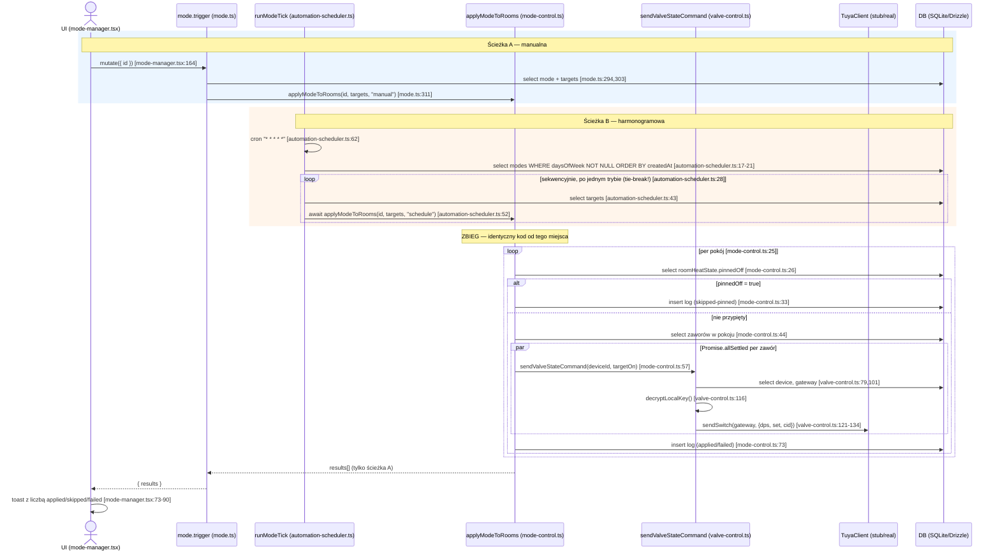

# Research: Przepływ aktywacji trybu (mode activation)

**Date**: 2026-06-23T11:55:26+02:00
**Researcher**: Claude (Sonnet 4.6)
**Git Commit**: `4b75f9d128666045cfd5f899e4ad7830b01610a1`
**Branch**: `main`
**Repository**: 10xdevs

> **Cel:** Badam przepływ aktywacji trybu (mode trigger) — zaczynam od `src/app/_components/setup/mode-manager.tsx` (przycisk "Trigger") — bo `context/map/repo-map.md` §4 (Strefy ryzyka) oznaczyła `valve-control.ts` jako chokepoint (Ca=Ce=7, "rzadko dotykane, ale dotyka wszystkiego") i parę `mode-form.tsx`↔`mode-manager.tsx` jako jedyny cykl zależności w repo, leżący w najnowszym kodzie — a §7 (Ograniczenia, przeniesione z artifact-2 "co sprawdzić dalej") zostawiła otwarte pytanie, czy `valve-control.test.ts` faktycznie pokrywa wszystkie 4 ścieżki wywołania.

## Research Question

Przeanalizuj przepływ aktywacji trybu (mode) — od UI trigger przez `mode.trigger`, `applyModeToRooms`, `valve-control.ts`, do klienta Tuya — ze szczególnym uwzględnieniem stref ryzyka z `context/map/repo-map.md`. Trzy sub-pytania (trace e2e / luki w testach / blast radius), wyłącznie analiza stanu obecnego, bez propozycji refaktoru.

## Summary

Przepływ ma dwa wejścia (manualny trigger z UI, cron co minutę) zbiegające się w jednej funkcji (`applyModeToRooms`), która jest jedynym miejscem zapisu stanu (log aktywacji + komenda do zaworu). To dobrze zaprojektowany szew — ale **pokrycie testowe jest złudne**: każda granica warstwy jest zamockowana w każdym teście, więc realny błąd na styku warstw (np. zła kolejność argumentów tego samego typu) nie zostałby wykryty przez żaden istniejący test, ani przez TypeScript. `valve-control.test.ts` pokrywa tylko 3 z 8 gałęzi `sendValveStateCommand` — i robi to w izolacji, nigdy przez żadnego z 3 realnych wywołujących. Blast radius kontraktu `mode.ts` jest średni (4 pliki klienckie, 8 wywołań), ale jeden z konsumentów (`mode-manager.tsx`) ręcznie duplikuje typ wyjściowy `mode.list` zamiast go wyprowadzać z `RouterOutputs` — co jest precyzyjnie tym rodzajem długu, którego kompilator NIE wykryje automatycznie.

## Feature overview

### Co robi ta funkcja (przepływ, nie spis plików)

**Skąd wchodzą dane** — dwa niezależne wejścia, oba kończą się w tym samym miejscu:
- **Manualnie**: administrator klika "Trigger" przy trybie w panelu Setup (`mode-manager.tsx:164`) → `api.mode.trigger.useMutation` wysyła `{ id: mode.id }`.
- **Harmonogramowo**: `node-cron` budzi `runModeTick()` co minutę (`automation-scheduler.ts:62-64`, zarejestrowane raz przy starcie serwera przez `src/instrumentation.ts:6-9`) → funkcja sama odpytuje DB o tryby z ustawionym harmonogramem (`daysOfWeek IS NOT NULL`, sortowane `createdAt ASC`) i filtruje po dniu/godzinie/minucie.

**Kto waliduje** — walidacja jest rozdzielona na dwóch poziomach:
1. Kontrakt: `mode.trigger`'s input to Zod `{ id: z.string() }` (`mode.ts`); istnienie trybu sprawdzane jawnie (`NOT_FOUND` jeśli brak — `mode.ts:294-301`).
2. Logika domenowa: `applyModeToRooms` sprawdza **per pokój**, czy pokój jest ręcznie "przypięty" jako wygaszony (`roomHeatState.pinnedOff`, `mode-control.ts:26-29`) — to jest twarda reguła biznesowa: ręczne wygaszenie wygrywa z każdym trybem, zawsze, niezależnie czy trigger jest manualny czy harmonogramowy.

**Gdzie zmienia się stan** — dokładnie dwa miejsca zapisu, oba w `applyModeToRooms` (`mode-control.ts:18-85`), zawsze razem, nigdy osobno:
1. Komenda do fizycznego urządzenia: `sendValveStateCommand(deviceId, targetOn)` per zawór w pokoju, wysyłana równolegle (`Promise.allSettled`, `mode-control.ts:55-58`) do `valve-control.ts:75-142`, które samo odszyfrowuje klucz lokalny bramki (`decryptLocalKey`, AES-256-GCM) i woła `getTuyaClient().sendSwitch(...)` — albo prawdziwego klienta LAN (`real-client.ts`), albo stuba (`stub-client.ts`, aktywny w tym repo lokalnie, `TUYA_STUB=true` w `.env`).
2. Wiersz w `automationModeActivationLogs` per pokój, niezależnie od wyniku (`applied`/`skipped-pinned`/`failed`) — to jedyne miejsce, gdzie wynik triggera harmonogramowego jest w ogóle obserwowalny (UI nie ma widoku historii — to świadomy non-goal z planu `automation-rework`).

**Co wraca**:
- Ścieżka manualna: `{ results: ModeApplicationResult[] }` z powrotem do `mode-manager.tsx`, które liczy `applied`/`skipped (pinned)`/`failed` i renderuje jeden toast (`mode-manager.tsx:73-90`).
- Ścieżka harmonogramowa: **nic nie wraca do UI** — `runModeTick` odrzuca zwróconą wartość `applyModeToRooms` (`automation-scheduler.ts:52`, brak przypisania). Jedynym śladem jest log w bazie i wpis w strukturalnym loggerze (`automation-scheduler.mode-tick-complete`).

### Punkt zbiegu

Obie ścieżki są **identyczne kodowo** od `applyModeToRooms(modeId, targets, triggeredBy)` w dół (`mode-control.ts:18`). `triggeredBy` ("manual" / "schedule") jest niesione wyłącznie jako wartość do zalogowania — nigdzie nie rozgałęzia logiki.

### Evidence / Inference / Unknown (Feature overview)

**EVIDENCE** (przeczytane wprost, file:line):
- Pełny łańcuch manualny: `mode-manager.tsx:164,71-90` → `mode.ts:291-314` → `mode-control.ts:18-85` → `valve-control.ts:75-142` → `dp-codes.ts:24-27` → `crypto.ts:26-34` → `tuya/index.ts:6-8`.
- Pełny łańcuch harmonogramowy: `instrumentation.ts:1-11` → `automation-scheduler.ts:9-65`, łącznie z jawnym komentarzem o sekwencyjności jako mechanizmie tie-break (linie 25-27).
- Schema: `roomHeatState` (`schema.ts:232-253`), `automationModeActivationLogs` (`schema.ts:297-329`).
- `.env` lokalnie: `TUYA_STUB=true` → w tym konkretnym checkout `getTuyaClient()` zwraca stub, nie realny klient LAN.
- Dokładny tekst toastów i logika liczenia: `mode-manager.tsx:73-89`.

**INFERENCE** (wywnioskowane, nie zaobserwowane wprost):
- Że `cron.schedule("* * * * *", ...)` faktycznie odpala się co minutę w produkcji — przeczytano tylko kod rejestracji, nie obserwowano runtime (restart serwera, wiele instancji, pominięte ticki — nieprzebadane).
- Że `device.nodeId` jest zawsze wypełniony dla zaworów docierających do `sendValveStateCommand` — wywnioskowane z `?? undefined`, nie zweryfikowane względem realnych danych seed/produkcyjnych.

**UNKNOWN**:
- Czy `TUYA_STUB` jest inaczej ustawiony w środowisku produkcyjnym (sprawdzono tylko lokalny `.env`) — nie można potwierdzić, który klient jest aktywny poza tym konkretnym checkout.
- Czy hot-reload w `next dev` może zarejestrować `runModeTick` więcej niż raz (nieprzebadane poza jednym wywołaniem `register()` w `instrumentation.ts`).

## Technical debt

To nie jest "ten obszar jest czuły" w ogólności — to konkretne rodzaje ryzyka, z rozróżnieniem na **prawdziwy dług** (CI go nie złapie) i **tani dług** (kompilator/test go złapie, tylko nikt jeszcze nie posprzątał).

### 1. Prawdziwy dług: każda granica warstwy jest zamockowana — żaden test nie biegnie przez realny łańcuch

**Dowód**: wszystkie 5 plików testowych na tej ścieżce (`mode.test.ts`, `mode-control.test.ts`, `automation-scheduler.mode-tick.test.ts`, `valve-control.test.ts`, `room.toggle-heat.test.ts`) mockują dokładnie tę funkcję, którą sąsiad-test traktuje jako jednostkę pod testem:

| Test | Mockuje | Realnie testuje |
|---|---|---|
| `mode.test.ts` | `applyModeToRooms` | tylko że `mode.trigger` przekazuje poprawne argumenty |
| `mode-control.test.ts` | `sendValveStateCommand` | tylko logikę `applyModeToRooms` (pin-check, allSettled, log) |
| `automation-scheduler.mode-tick.test.ts` | `sendValveStateCommand` | tylko logikę dopasowania harmonogramu + tie-break |
| `valve-control.test.ts` | `db`, `getTuyaClient`, `decryptLocalKey` | tylko `sendValveStateCommand` w izolacji, **z syntetycznym wejściem, nigdy przez realnego wywołującego** |
| `room.toggle-heat.test.ts` | `sendValveStateCommand` | tylko logikę pinowania pokoju |

**Dlaczego to prawdziwy dług**: gdyby ktoś podmienił kolejność argumentów `sendValveStateCommand(deviceId, isOpen)` na `(isOpen, deviceId)` w jednym z 2 realnych (produkcyjnych) wywołań — i przypadkiem zachował typy zgodne (np. przez błąd w innym miejscu, albo gdyby `isOpen` było stringiem z bazy) — żaden z tych testów by tego nie wykrył, bo każdy z nich asercjonuje tylko "co zostało przekazane do mocka", nie "czy mock zaakceptowałby to w realnym wykonaniu". TypeScript złapałby oczywisty type-mismatch (string vs boolean), ale nie złapałby swapu dwóch argumentów tego samego typu. **Potwierdzono jednak: obecnie nie ma takiego swapu** — oba realne call site'y (`mode-control.ts:57`, `room.ts:378`) przekazują argumenty w poprawnej kolejności (zweryfikowane `ast-grep`em, patrz "Weryfikacja strukturalna" — pierwsza wersja tej sekcji błędnie liczyła 3 call site'y, licząc samą definicję funkcji jako jedno z wywołań). To jest dług utajony, nie aktywny bug.

### 2. Prawdziwy dług: `sendValveStateCommand` ma 8 gałęzi, 3 są testowane — i nigdy przez żadnego z 3 realnych wywołujących

Z 8 gałęzi (`DEVICE_NOT_FOUND`, `UNSUPPORTED_DEVICE`, `DEVICE_NOT_PAIRED`, `GATEWAY_NOT_FOUND`, `GATEWAY_KEY_NOT_SET`, `KEY_DECRYPT_FAILED`, `COMMAND_FAILED`, happy path) — tylko `DEVICE_NOT_FOUND`, `UNSUPPORTED_DEVICE` i happy path są pokryte, wszystkie w `valve-control.test.ts` z syntetycznymi danymi. **Ciekawostka asymetrii**: `sendSetpointCommand` (siostrzana funkcja w tym samym pliku, dla innego flow — setpoint) ma test dla `GATEWAY_KEY_NOT_SET` (`device.setpoint.test.ts:126-136`), ale `sendValveStateCommand` — funkcja faktycznie używana przez tryb mode — nie ma odpowiednika. To wygląda jak "skopiowano wzorzec testów, ale nie dokończono dla drugiej funkcji" — klasyczny tani-do-naprawienia, ale realnie nieobecny dług.

### 3. Prawdziwy dług: gwarancja tie-break opiera się na komentarzu, nie na zweryfikowanym zapytaniu DB

Mechanizm "później utworzony tryb wygrywa" (`automation-scheduler.ts:25-27`) zależy od tego, że `.orderBy(automationModes.createdAt)` faktycznie zwraca wiersze w kolejności rosnącej pod współbieżnymi zapisami. Test (`automation-scheduler.mode-tick.test.ts:126-145`) **realnie asercjonuje kolejność wywołań** (`toHaveBeenNthCalledWith`) — to dobry test — ale weryfikuje tylko, że sekwencyjna pętla `for` zachowuje kolejność tablicy, którą sam mock jej podaje. Nie weryfikuje, że prawdziwe zapytanie SQL z `ORDER BY created_at` rzeczywiście zwróci tę kolejność w produkcji pod konkurencyjnymi zapisami. To jest założenie udokumentowane komentarzem, nie testem na żywej bazie.

### 4. Cichy dług kontraktu: `mode-manager.tsx` ręcznie duplikuje typ `mode.list`, nie wyprowadza go z `RouterOutputs`

`mode-manager.tsx:16-23` definiuje własny interfejs `ModeSummary` ręcznie, podczas gdy `cc-modes-widget.tsx:7` wyprowadza analogiczny typ z `RouterOutputs["mode"]["list"][number]` — czyli kontraktowo bezpiecznie. Gdyby `mode.list` zmieniło kształt (np. dodało pole, zmieniło typ `daysOfWeek`), `cc-modes-widget.tsx` złapałby to natychmiast (błąd kompilacji), a `mode-manager.tsx` **nie złapałby tego wcale**, dopóki niezgodne pole nie zostałoby faktycznie użyte gdzieś w kodzie. To jest precyzyjnie ten rodzaj długu, który CI nie wykrywa automatycznie — wymaga ręcznego review, że dwa źródła prawdy o tym samym kontrakcie się nie rozjeżdżają.

### 5. Tani dług (kompilator złapie): cykl `mode-form.tsx` ↔ `mode-manager.tsx`

Potwierdzone ponownie na żywym drzewie (re-run `dependency-cruiser`): cykl wciąż istnieje. Strona `mode-form.tsx → mode-manager.tsx` jest `import type` (zero runtime, złapane przez `tsc` przy niezgodności kształtu). Strona odwrotna `mode-manager.tsx → mode-form.tsx` to **realny import wartości** (`ModeForm` komponent) — to jest faktyczna zależność runtime, nie tylko typu. Zmiana `Props` w `mode-form.tsx` złamie wywołanie JSX w `mode-manager.tsx:121-126` przy kompilacji. Tani dług architektoniczny (typy mieszkają w niewłaściwym pliku z perspektywy nowego developera), ale nie cichy — kompilator i tak go wymusi naprawić przy realnej zmianie kształtu.

### 6. Oczekiwane, nie dług: sprzężenie schema ↔ migracje ↔ router

Każda zmiana w `automationModes`/`automationModeTargets`/`automationModeActivationLogs` generuje nową migrację + snapshot + wpis w journalu — potwierdzone, że to się stało dokładnie tak (commit `ff0db16`: `schema.ts` + 3 pliki generowane, zero wyjątków). To jest architektura tego stacku (Drizzle), nie dług — wymieniam tylko, żeby odróżnić od realnych problemów powyżej.

### Evidence / Inference / Unknown (Technical debt)

**EVIDENCE**: wszystkie liczby gałęzi, listy mocków, grep-y i cytowane asercje (`toHaveBeenNthCalledWith`) pochodzą z bezpośredniego odczytu plików testowych i źródłowych przez sub-agentów badawczych (pełne ścieżki plików w sekcji "Code References" poniżej).

**INFERENCE**: że swap argumentów tego samego typu "by przeszedł niezauważony" jest wywnioskowane z analizy struktury mocków, nie zademonstrowane przez faktyczne wprowadzenie i przetestowanie regresji.

**UNKNOWN**: czy istnieją testy e2e/Playwright poza tym zestawem plików, które dotykają tego przepływu z realną (lub kontenerową) bazą — nie sprawdzano poza pięcioma wymienionymi plikami testowymi; czy konfiguracja Vitest/tsconfig ma ściślejsze typowanie mocków, które wyłapałoby część ryzyk z punktu 1 — nie zweryfikowano względem `vitest.config.ts`.

## Code References

- `src/app/_components/setup/mode-manager.tsx:164` — przycisk Trigger, wejście do przepływu manualnego
- `src/app/_components/setup/mode-manager.tsx:73-90` — liczenie applied/skipped/failed + toast
- `src/app/_components/setup/mode-manager.tsx:16-23` — ręcznie zduplikowany `ModeSummary` (dług #4)
- `src/app/_components/setup/mode-form.tsx:10` — `import type { ModeRoomOption, ModeSummary } from "./mode-manager"` (cykl, strona type-only)
- `src/app/_components/cc-modes-widget.tsx:7` — kontraktowo bezpieczny `RouterOutputs`-derived typ (kontrast z mode-manager.tsx)
- `src/server/api/routers/mode.ts:291-314` — procedura `trigger`
- `src/server/api/routers/mode.ts:127-315` — pełny kontrakt routera (5 procedur)
- `src/server/lib/mode-control.ts:18-85` — `applyModeToRooms`, punkt zbiegu obu ścieżek
- `src/server/lib/valve-control.ts:75-142` — `sendValveStateCommand`, 8 gałęzi, 3 testowane
- `src/server/lib/valve-control.test.ts:59-92` — jedyny plik testujący `sendValveStateCommand` w izolacji
- `src/server/workers/automation-scheduler.ts:9-65` — `runModeTick`, sekwencyjna pętla = mechanizm tie-break
- `src/server/workers/automation-scheduler.ts:25-27` — komentarz dokumentujący gwarancję tie-break
- `src/server/workers/automation-scheduler.mode-tick.test.ts:126-145` — test tie-break z `toHaveBeenNthCalledWith`
- `src/instrumentation.ts:1-11` — rejestracja schedulera przy starcie serwera
- `src/server/db/schema.ts:232-253,255-330` — `roomHeatState`, `automationModes`, `automationModeTargets`, `automationModeActivationLogs`
- `drizzle/0010_cooing_patriot.sql` — migracja tworząca tabele trybu (potwierdzone: jedyna migracja dotykająca `automation_mode*`)
- `src/server/lib/tuya/index.ts:6-8` — wybór klienta Tuya (stub vs real) po `TUYA_STUB`

## Architecture Insights

- **`triggeredBy` jako wartość, nigdy jako warunek** — to czysty wzorzec: jedna funkcja, jeden kod, różniący się tylko metadanymi logowania. Nowy kontrybutor dodający trzeci sposób wyzwalania trybu (np. webhook) powinien wejść przez ten sam punkt zbiegu, nie duplikować logikę.
- **Pin-check jest zawsze pierwszy, zawsze per pokój** — `applyModeToRooms` sprawdza `roomHeatState.pinnedOff` przed jakąkolwiek komendą do urządzenia, dla każdego pokoju niezależnie w tej samej pętli. To gwarantuje, że ręczne wygaszenie wygrywa niezależnie od tego, ile trybów/harmonogramów współzawodniczy o ten pokój.
- **`Promise.allSettled` lokalnie (per pokój), `for`-pętla globalnie (per tryb)** — równoległość jest świadomie ograniczona do urządzeń WEWNĄTRZ jednego pokoju; między trybami/pokojami jest sekwencyjna, bo to jest mechanizm tie-break, nie przypadkowy wybór wydajnościowy.

## Historical Context (from prior changes)

- `context/archive/2026-06-22-automation-rework/plan.md` — plan, który wprowadził cały ten przepływ (fazy 1-6); Faza 3 ("Scheduler rework") jawnie dokumentuje wymóg sekwencyjności jako "load-bearing" — niezależne potwierdzenie tego, co znaleziono w kodzie.
- `context/archive/2026-06-22-automation-rework/reviews/impl-review.md` — wcześniejszy przegląd implementacji tego samego kodu; znalazł i naprawił inny problem (`mode.delete` bez sprawdzenia istnienia) — niezwiązany z tym badaniem, ale potwierdza, że ten obszar już raz przechodził przegląd jakości.
- `context/map/artifact-1-territory.md`, `artifact-2-structure.md`, `artifact-3-contributors.md`, `repo-map.md` — bazowa mapa repo, z której wybrano ten cel badawczy (patrz "Cel" na górze tego dokumentu).

## Related Research

- `context/map/repo-map.md` §4-6 — strefy ryzyka, kogo zapytać, pierwszy dzień (ten research jest pogłębieniem jednego punktu z tej mapy)

## Open Questions

- Czy `TUYA_STUB` różni się między środowiskami (dev/staging/prod) — nie zweryfikowane poza lokalnym `.env`.
- Czy warto dodać JEDEN test integracyjny przez realny łańcuch `mode.trigger` → `sendValveStateCommand` (z zamockowanym tylko `tuyapi`/siecią, nie każdą warstwą pośrednią) — to jest decyzja do podjęcia w `/10x-plan`, nie w tym dokumencie.
- Czy `ModeSummary` w `mode-manager.tsx` powinien zostać zamieniony na `RouterOutputs`-derived typ (jak w `cc-modes-widget.tsx`) — kandydat na szybką, niskoryzykowną poprawkę, ale to też decyzja planistyczna, nie badawcza.

## Weryfikacja strukturalna (ast-grep)

Wszystkie twierdzenia STRUKTURALNE z tego raportu (liczby call-site'ów, liczność gałęzi, "tylko tutaj", powtarzające się kształty wywołań) zweryfikowane `ast-grep`em (zainstalowany przez `brew install ast-grep`, wersja 0.44.0). Zasada z lekcji zastosowana dosłownie: licz ast-grepem dla precyzji AST, każde zero potwierdź klasycznym grepem.

| Twierdzenie | Wzorzec ast-grep | Wynik | Werdykt |
|---|---|---|---|
| `sendValveStateCommand` ma 3 realne call site'y w produkcji | `sendValveStateCommand($A, $B)` na `src/` | 5 trafień: 3 w `valve-control.test.ts` (62,70,85), 2 produkcyjne (`mode-control.ts:57`, `room.ts:378`) | **DOPRECYZOWANE → 2**, nie 3. Pierwsza wersja raportu pomyłkowo doliczała linię definicji funkcji (`valve-control.ts:75`) jako "call site" — to był artefakt liczenia grepem po tekście, nie po AST. `ast-grep`'s wzorzec wywołania (nie deklaracji) poprawnie wykluczył definicję. Poprawiono w sekcji Technical debt #1. |
| `sendValveStateCommand` ma 8 gałęzi (7 throw + happy path) | `throw new Error($MSG)` na `valve-control.ts` | 14 trafień w pliku (7 dla `sendSetpointCommand` linie 23-71, 7 dla `sendValveStateCommand` linie 85-140) | **POTWIERDZONE** — dokładnie 7 throw-gałęzi + 1 happy path = 8 dla `sendValveStateCommand`. |
| Tylko 3 z 8 gałęzi testowane w `valve-control.test.ts` | `it($DESC, $FN)` + `$EXPR.rejects.toThrow($MSG)` na `valve-control.test.ts` | 3 bloki `it()` (linie 60,67,75), 2 asercje `.rejects.toThrow` (DEVICE_NOT_FOUND, UNSUPPORTED_DEVICE) | **POTWIERDZONE** dokładnie. |
| 5 plików testowych mockuje granice tego przepływu, zero testów przez realny łańcuch | `vi.mock("~/server/lib/valve-control", $F)` i `vi.mock("~/server/lib/mode-control", $F)` na `src/` | valve-control: 3 pliki (`mode-control.test.ts`, `automation-scheduler.mode-tick.test.ts`, `room.toggle-heat.test.ts`); mode-control: 1 plik (`mode.test.ts`) | **POTWIERDZONE** — razem z `valve-control.test.ts` (mockuje swoje zależności, nie siebie) = 5 plików na granicy, zero przez realny łańcuch. |
| `automationModeActivationLogs` używane w 2 plikach — najmniejszy blast radius | `automationModeActivationLogs` (identyfikator) na `src/` | `schema.ts`, `mode-control.ts` | **POTWIERDZONE** dokładnie. |
| 8 wywołań `api.mode.*` w 4 plikach klienckich | `api.mode.$METHOD` na `src/app` (`--lang tsx`) | 8 trafień w `cc-modes-widget.tsx`, `mode-manager.tsx`, `mode-form.tsx`, `device-overview.tsx` | **POTWIERDZONE** dokładnie. |
| `mode-manager.tsx` definiuje `ModeSummary` ręcznie (nie przez `RouterOutputs`) | `export interface ModeSummary { $$$ }` | **0 trafień z `--lang ts`**, 1 trafienie z `--lang tsx` (linie 16-23) | **POTWIERDZONE — po korekcie**. Zero z `--lang ts` było artefaktem złego flaga języka dla pliku `.tsx`, nie realnym brakiem; potwierdzone grepem (`interface ModeSummary` → 1 trafienie) zanim poprawiono flagę. |
| `cc-modes-widget.tsx` wyprowadza typ z `RouterOutputs` (kontraktowo bezpiecznie) | `RouterOutputs["mode"]["list"][number]` | **0 trafień z `--lang ts`**, 1 trafienie z `--lang tsx` (linia 7) | **POTWIERDZONE — po korekcie**, ta sama przyczyna zera jak wyżej. |
| Cykl: `mode-form.tsx` → `mode-manager.tsx` (type-only), `mode-manager.tsx` → `mode-form.tsx` (wartość) | `import $$$ from "./mode-manager"` / `"./mode-form"` (`--lang tsx`) | `mode-form.tsx:10` (`import type`), `mode-manager.tsx:9` (`import` wartości) | **POTWIERDZONE** dokładnie, obie strony. |
| `automationModes`/`automationModeTargets` używane w 3 plikach każde | `automationModes` / `automationModeTargets` (identyfikator) na `src/` | po 3 pliki każde: `schema.ts`, `mode.ts`, `automation-scheduler.ts` | **POTWIERDZONE** dokładnie. |
| Test tie-break asercjonuje kolejność wywołań (`toHaveBeenNthCalledWith`) | `expect($MOCK).toHaveBeenNthCalledWith($N, $$$ARGS)` na `automation-scheduler.mode-tick.test.ts` | 2 trafienia, linie 143-144, dokładnie cytowane wartości | **POTWIERDZONE** dokładnie. |
| Tylko migracja 0010 dotyka tabel `automation_mode*`, 0011 nie dotyka | *(poza domeną ast-grep — SQL, nie TS/TSX)* | `grep -l "automation_mode" drizzle/*.sql` → tylko `0010_cooing_patriot.sql`; `grep -c` na `0011_...sql` → 0 | **POTWIERDZONE grepem** (jedyne dostępne narzędzie dla plików `.sql`; ast-grep nie ma tu zastosowania). |

**Najważniejsza lekcja metodologiczna z tej weryfikacji**: dwa zera z `ast-grep` (`ModeSummary`, `RouterOutputs` w plikach `.tsx`) były **artefaktem złej flagi języka** (`--lang ts` zamiast `--lang tsx`), nie realnym brakiem wystąpień — wykryte tylko dzięki regule "każde zero potwierdź grepem". Bez tej dyscypliny raport zawierałby fałszywie obalone twierdzenie o jednym z najważniejszych przykładów cichego długu (#4 w sekcji Technical debt). Z kolei jedno twierdzenie (call site'y `sendValveStateCommand`) zostało faktycznie **doprecyzowane w dół** (3→2) — to jest odwrotny przypadek: grep dał liczbę zawyżoną (liczył definicję funkcji jako wywołanie), a AST-precyzyjny wzorzec `ast-grep`a poprawnie odróżnił deklarację od wywołania.
