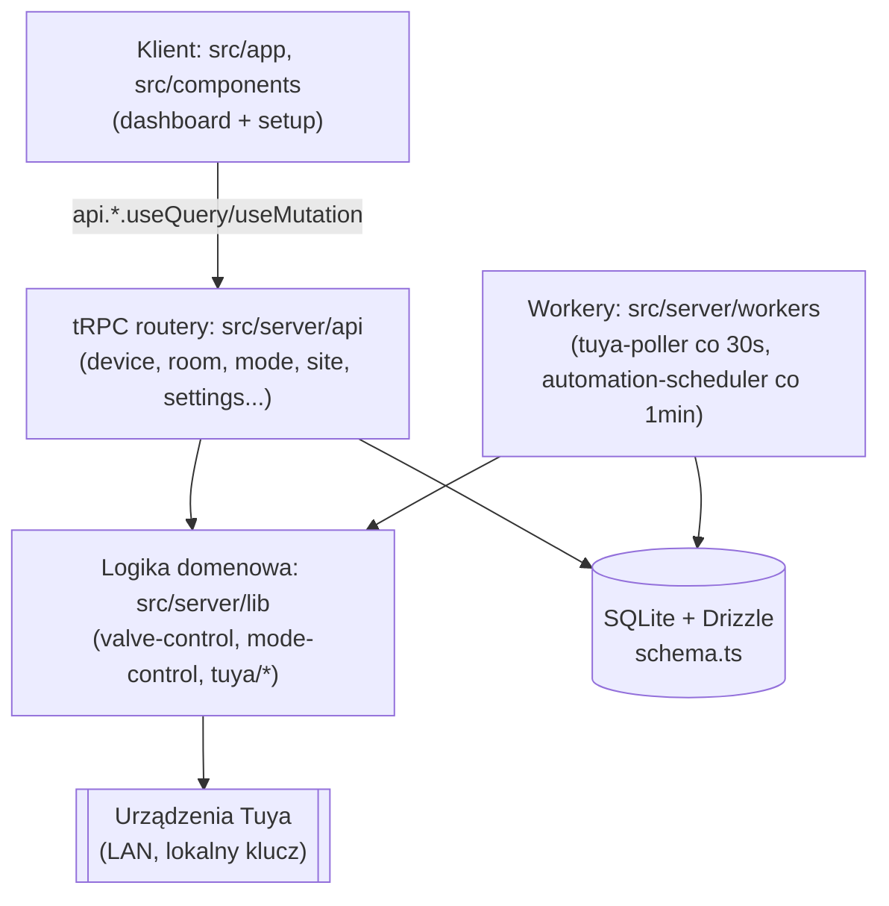

# Repo Map — Tuya Device Dashboard

> Synteza z `artifact-1-territory.md` (historia gita), `artifact-2-structure.md` (dependency-cruiser) i `artifact-3-contributors.md` (kontrybutorzy). Nie powtarza ich tabel — odsyła do nich po szczegóły.

## 1. TL;DR

To LAN-only dashboard do monitorowania i kontroli urządzeń Tuya (zawory grzewcze, czujniki, gniazdka) dla małego zespołu facility management — bez połączenia z internetem, bo chmurowy portal Tuya jest niedostępny w sieci klienta. Next.js App Router + tRPC + Drizzle/SQLite, jeden background poller (co 30s czyta urządzenia po LAN) i jeden scheduler (co minutę odpala harmonogramy). To bardzo młode repo — **15 dni historii, 164 commity, jeden autor-człowiek** — ale tempo zmian jest legacy-podobne: cztery kolejne redesigny UI i jedna kompletna wymiana systemu automatyzacji w tym czasie. Praca skupia się dziś najmocniej w UI dashboardu (`src/app/_components`) i panelu admina (`setup/`); najbardziej "boli" tam, gdzie struktura katalogów sugeruje bezpieczeństwo, którego nie ma (`server/lib/scoring.ts` to czysta logika, mimo nazwy folderu) i tam, gdzie jeden plik jest jedynym mostem do sprzętu (`valve-control.ts`).

## 2. Teren

**Duża odpowiedzialność, mało plików** — `src/app/_components` (płaski poziom, bez `setup/`) to *de facto* największy hotspot repo: 94 commity, więcej niż cały `server/api/routers` (60). To nietypowy podział dla T3-stylowej apki — tu UI dashboardu, nie backend, jest najmniej stabilnym obszarem (4 kolejne redesigny: S-15→S-17→S-19→S-21 plus prace tego tygodnia).

**Moduły płytkie vs głębokie** — `device-overview.tsx` (25 commitów git-history, Ce=26 w grafie zależności) jest płytki strukturalnie (jeden duży komponent, nie warstwa abstrakcji) ale głęboki odpowiedzialnościowo — łączy KPI, drag-and-drop, filtry, widgety. Kontrast: `valve-control.ts` jest płytki *i* wąski (jedna funkcja eksportowana na typ komendy), ale strukturalnie głęboki — Ca=Ce=7, jedyna droga do sprzętu.

**Aktywność w czasie** — trzy tygodnie repo mają wyraźnie różny środek ciężkości (pełne dane: artifact-1 §"Nacisk pracy w czasie"): tydzień 1 to fundament (Tuya, `components/ui`, schema), tydzień 2 to eksplozja w dashboardzie, tydzień 3 (w trakcie) przesuwa się do `setup/` — spójne z tym, że ostatnia duża zmiana (automation rules → modes) żyje tam.

**Peryferia** — `src/components/ui` (17 commitów, zero importów w górę — granica trzymana poprawnie, patrz §3) i `src/lib` (4 pliki, w tym jeden martwy — `device-type-colors.ts`) to stabilne, mało ryzykowne obszary brzegowe.

## 3. Realne powiązania

Trzy różne źródła dowodów, każde mówi co innego — i to jest ważne, żeby ich nie mylić:

- **Z historii gita** (artifact-1): `api/routers` ↔ `server/lib` to najsilniejsze sprzężenie commitowe (14 wspólnych commitów) — nowy endpoint praktycznie zawsze ciągnie zmianę w logice. To pattern pracy, nie zależność w kodzie.
- **Z grafu importów** (artifact-2): tylko **jeden realny cykl** w całym `src/` — `mode-form.tsx` ↔ `mode-manager.tsx`, częściowo type-only. To zależność w kodzie, nie pattern pracy — i dotyczy najnowszego obszaru (`setup/`, automation rework, ten tydzień).
- **Obszar, którego żadne narzędzie nie objęło dobrze**: granica "co jest faktycznie server-only" w `src/app` (App Router miesza Server Actions/Route Handlers z Client Components w jednym folderze) — to jest **`unknown`** dla dependency-cruiser, nie "brak powiązania". 5 z 6 zgłoszonych naruszeń granicy okazały się fałszywymi alarmami po ręcznym sprawdzeniu `"use client"`/`"use server"`.

**"Wspólny mianownik"** (oba artefakty się zgadzają): `schema.ts` (Ca=17 w grafie, 14 commitów, 13 różnych obszarów-partnerów) i `root.ts` (Ca=11, 11 commitów, 13 partnerów) to dwa "spine"-pliki, przez które fizycznie musi przejść każda nowa domena funkcjonalności w tym stacku (Drizzle + tRPC) — to architektura, nie przypadek.

**Coupling z generowanych/automatycznych zmian, nie ręcznych edycji** — odfiltrowano z analizy (nie liczy się jako realne sprzężenie ręczne): `package-lock.json`, `drizzle/meta/*.json` (output `db:generate`, nie ręczne edycje), pliki migracji `.sql`. `package.json` *jest* ręcznie edytowany (nowa zależność per feature) — ma wysoki fan-out partnerski (15 obszarów), ale to oczekiwane i nieinteresujące samo w sobie.

## 4. Strefy ryzyka

| Strefa | Dlaczego |
|---|---|
| **`device-overview.tsx`** | Dwa niezależne sygnały (git-history #1, fan-out #1 w repo, Ce=26, instability 96%) wskazują to samo miejsce — najwyższy "tu boli" wniosek z całej analizy. Zmiana w izolacji praktycznie niemożliwa bez integracyjnego testu. |
| **`valve-control.ts`** | Niska częstotliwość zmian (3 commity), ale chokepoint Ca=Ce=7 — jedyna droga do sprzętu dla 4 niezależnych funkcji (setpoint, valve toggle, mode trigger, automation tick). "Rzadko dotykane, ale gdy dotykane, dotyka wszystkiego." |
| **`mode-form.tsx` ↔ `mode-manager.tsx`** | Jedyny cykl zależności w repo, leży w najnowszym, najmniej "ostudzonym" kodzie (automation rework, ten tydzień). |
| **`schema.ts` / `root.ts`** | Najwyższy fan-in w repo (17 / 11), prawie zerowa instability — "mała zmiana" tu nigdy nie jest mała, naturalny hotspot konfliktów merge. |
| **Granica `src/server/lib` ↔ rzeczywiste bezpieczeństwo** | Folder "server" sugeruje server-only, ale `scoring.ts` jest czystą logiką importowaną przez klienta. Odwrotne ryzyko: ktoś *zakłada* bezpieczeństwo serwerowe pliku w `server/lib` bez weryfikacji treści. |
| **Historia automatyzacji (`automation_rule` → `automation_mode*`)** | Dwie generacje tabel/routerów/komponentów dla "automatyzacji" zostały zbudowane i częściowo usunięte **w tej samej 15-dniowej historii**. Grep po starych nazwach (`automation.ts`, `automationRules`) w historii gita trafi na kod, który już nie istnieje na dysku (potwierdzone w artifact-1). |

## 5. Kogo zapytać

Repo ma **jednego autora-człowieka** na 164 commity (`Karol <karol.paniewski@gmail.com>`) — nie ma "eksperta od X" do wyboru. Pytanie praktyczne to nie "kogo", a "o jaki temat", bo 45% commitów ma trailer `Co-Authored-By: Claude` — część kodu jest AI-asystowana, więc pamięć autora bywa słabszym źródłem niż commit message/plan zmiany.

| Strefa | Kandydat | O co konkretnie pytać |
|---|---|---|
| `device-overview.tsx` / dashboard | Karol — `dashboard-command-center-redesign`, `visual-ux-redesign`, `dashboard-ux-redesign` | "Który redesign wprowadził X" — plik przeszedł kilka generacji stylistyki, nie jedną |
| `valve-control.ts` / Tuya | Karol — `room-heat-toggle`, `testing-valve-control-scoring` | Protokół DP-kodów (`dp-codes.ts`) i różnica real-client vs stub-client, zanim cokolwiek tu zmienisz |
| `setup/` / modes | Karol — `automation-rework` (ten tydzień, najświeższy kontekst w repo) | Czemu typy `ModeRoomOption`/`ModeSummary` mieszkają w `mode-manager.tsx`, nie w osobnym pliku — decyzja jeszcze "ciepła" |
| `api/routers` | Karol — `automation-rules` → `automation-rework` | Pytaj z założeniem, że odpowiedź może być "już nieaktualne, zobacz Y" — to pełny cykl życia jednej funkcji w 15 dniach |
| `schema.ts` | Karol — `device-schema`, `automation-rework` | Stare nazwy tabel automatyzacji w historii gita, jeśli na nie natrafisz |

(Pełne tabele tematyczne per obszar: `artifact-3-contributors.md`.)

## 6. Pierwszy dzień — od czego zacząć

1. **`context/foundation/roadmap.md`** — kontekst produktowy przed kodem: co to za produkt, w jakiej kolejności budowany.
2. **`src/server/db/schema.ts`** — cały model domeny w jednym pliku; najwyższy fan-in w repo (Ca=17), fundament wszystkiego poniżej.
3. **`src/server/api/root.ts`** — mapa wszystkich routerów; punkt wejścia do API, drugi "spine"-plik.
4. **`src/server/api/routers/device.ts`** — najbardziej rozgałęziony router (Ce=11); pokazuje wzorzec tego repo (Zod input, `protectedProcedure`, `TRPCError` z message-jako-kod).
5. **`src/server/lib/valve-control.ts`** — chokepoint kontroli fizycznych urządzeń; zrozum go *zanim* dotkniesz czegokolwiek związanego z Tuya.
6. **`src/app/_components/device-overview.tsx`** — największy hotspot UI w repo (25 commitów, Ce=26); zobacz strukturę (KPI, widgety, DnD) zanim coś tu zmienisz.
7. **`src/app/_components/setup/mode-manager.tsx` + `mode-form.tsx`** — najnowszy, najcieplejszy kod, z jedynym cyklem zależności w repo; dobry test zrozumienia całego stosu (UI → API → lib → DB) na świeżym przykładzie.
8. **`src/server/workers/automation-scheduler.ts`** — jak background tick (co minutę) różni się od typowego request/response flow reszty apki.

## 7. Ograniczenia

- **Okno czasowe**: "12 miesięcy" z promptu pokrywa **całą historię repo** (15 dni, 164 commity) — to mapa bardzo młodego projektu w intensywnym tempie, nie legacy w klasycznym sensie. Wnioski o "stabilności" (np. niska instability `schema.ts`) opierają się na 15 dniach, nie latach — mogą się zmienić szybko.
- **Metoda**: git-history (co się zmienia i jak często) + dependency-cruiser na `src/` (co od czego zależy strukturalnie, 163 moduły/444 zależności) + commit metadata (kto, ile AI-asysty). Nie obejmuje: zachowania w runtime, jakości testów (tylko czy istnieją i co mockują), treści SQL, configów poza `src/`.
- **Granica App Router jest `unknown` dla narzędzia**: dependency-cruiser nie odróżnia Server Action/Route Handler od Client Component po samej ścieżce folderu — 5 z 6 zgłoszonych naruszeń granicy `app→server` to fałszywe alarmy, zweryfikowane ręcznie. Każda przyszła reguła granic potrzebuje świadomości `"use client"`/`"use server"`, nie tylko ścieżki.
- **Jeden kontrybutor-człowiek** czyni Artefakt 3 nietypowym — nie ma rozkładu wiedzy między ludźmi do zmapowania, tylko rozkład *tematów* u jednej osoby plus stopień AI-asysty (45% commitów). "Kogo zapytać" w praktyce znaczy "jak zadać pytanie Karolowi, żeby trafić w konkretny change-id".
- **To mapa, nie audyt bezpieczeństwa ani plan refaktoru** — zidentyfikowane ryzyka (np. `scoring.ts` pod `server/lib`, cykl w `mode-form`/`mode-manager`) są opisane z dowodem, ale decyzje co z nimi zrobić (przenosić plik? rozbijać komponent?) to praca dla `/10x-plan`, nie dla tego dokumentu.
